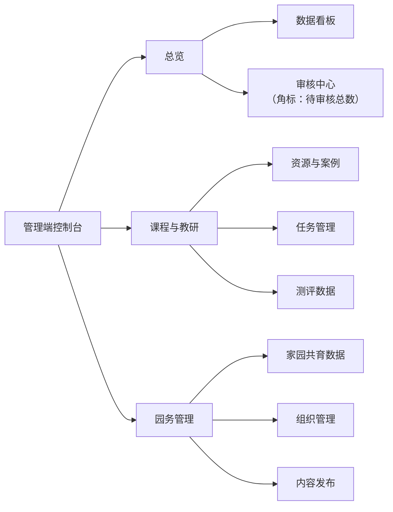
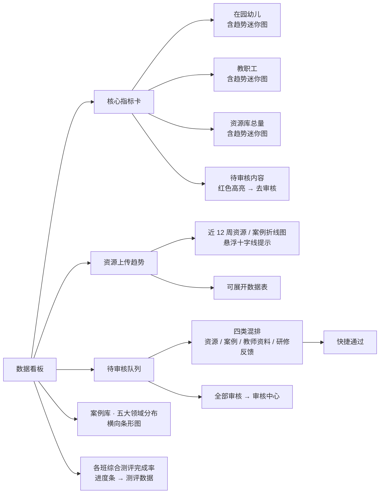
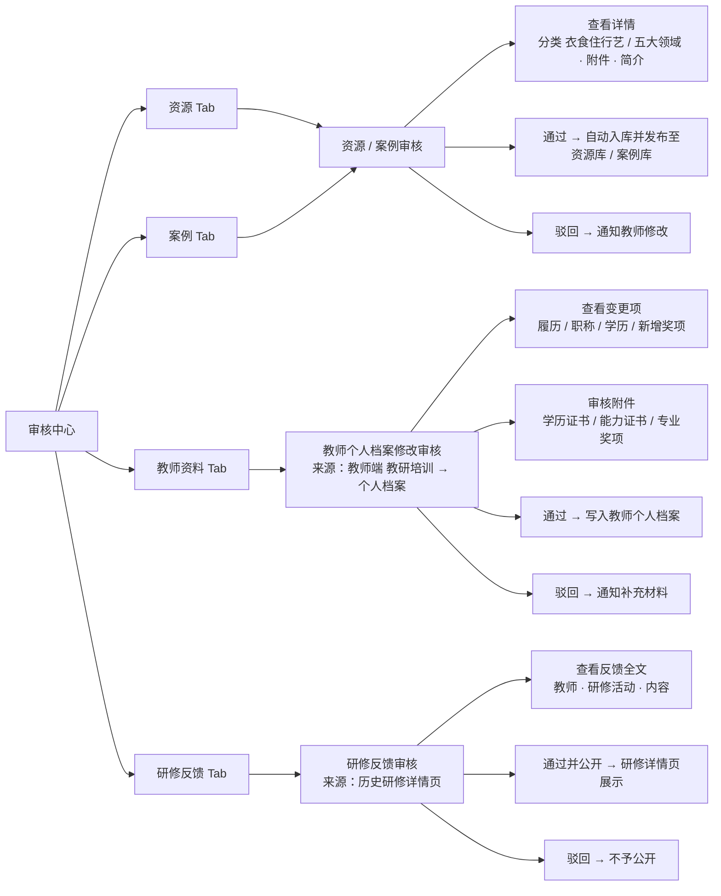
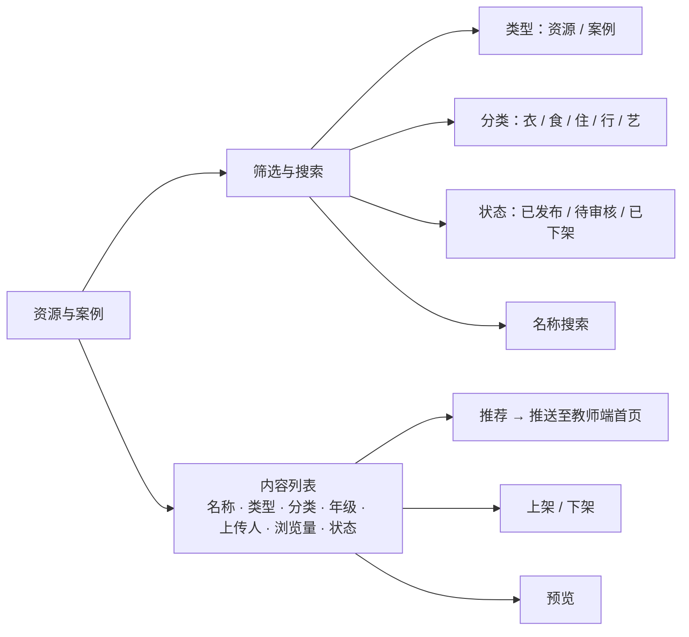
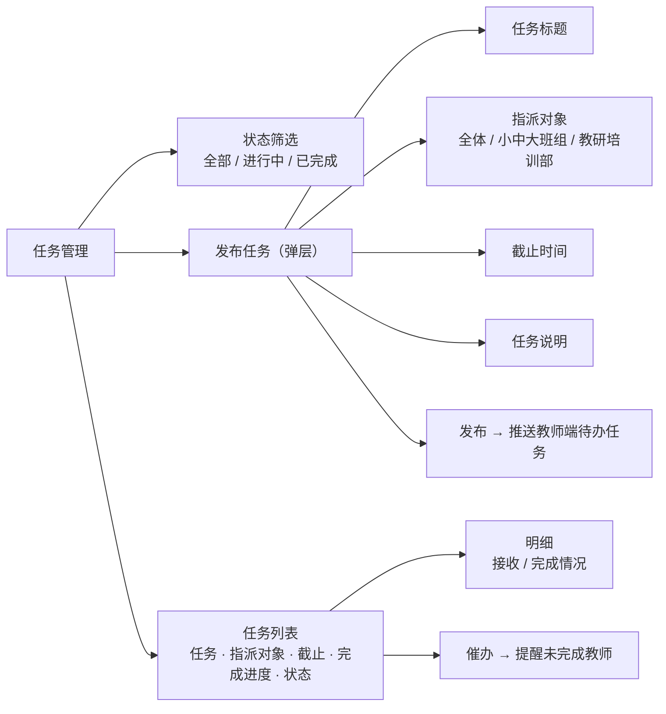
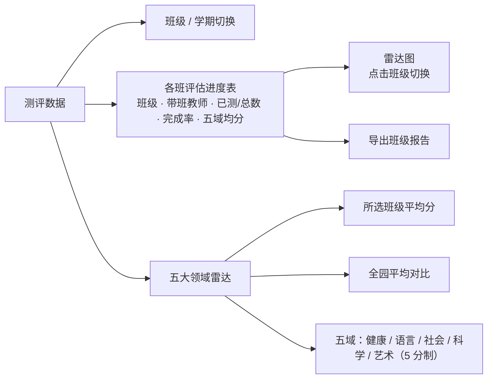
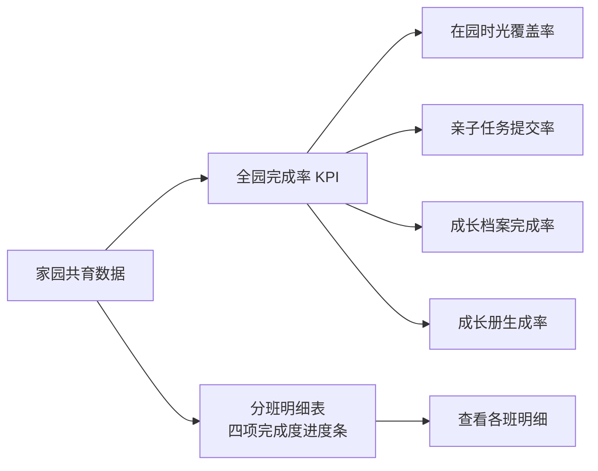
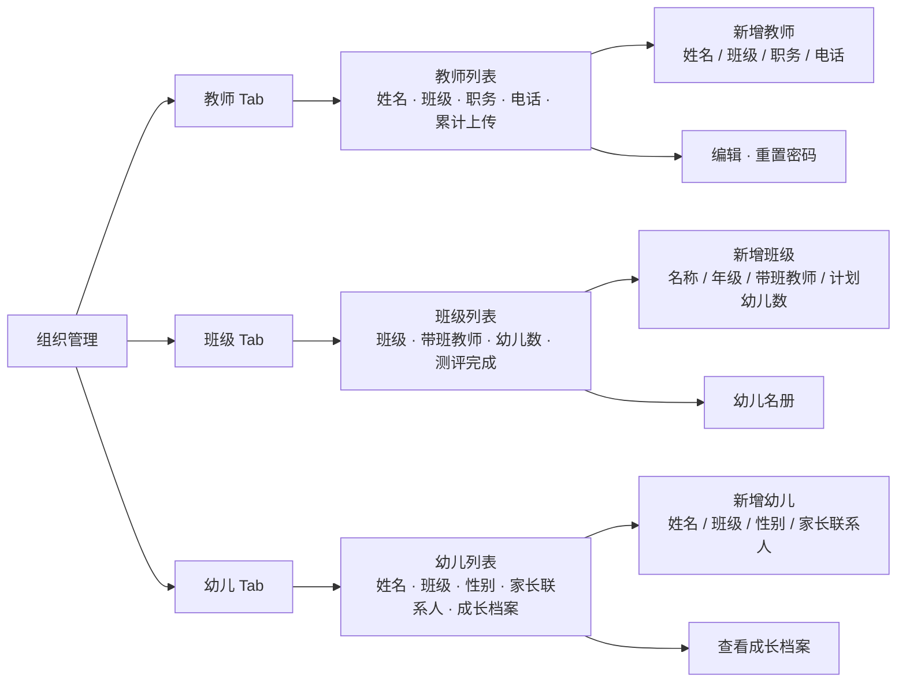
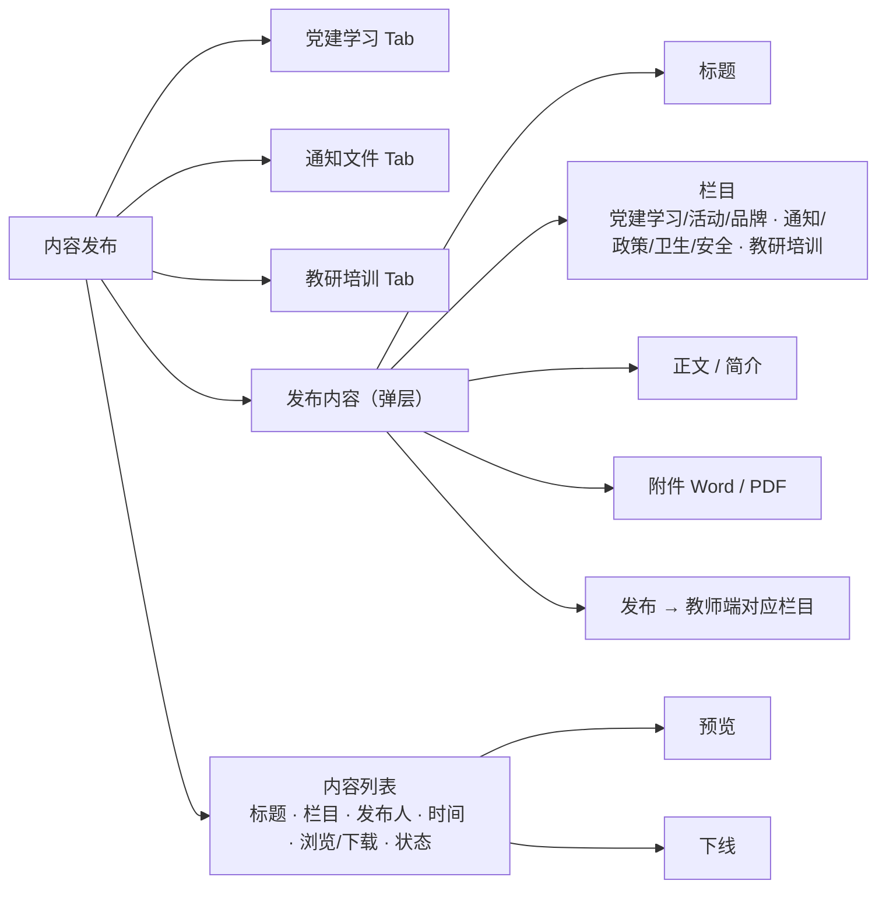
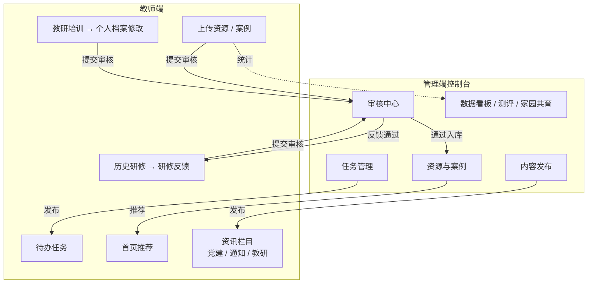

# 化龙幼儿园 · 管理端控制台 信息架构

> 面向幼儿园管理者（园长 / 各部门负责人）的 PC 端数据管理后台。
> 原型形态：单文件 `index.html`，左侧固定导航 + 右侧多视图切换。
> 本文档用于团队内部分享，Mermaid 流程图可在支持 Mermaid 的编辑器（VS Code、语雀、飞书、GitHub）中直接渲染。

---

## 一、整体导航结构

左侧导航分三个分组，共 8 个主视图。

---

## 二、数据看板（首页总览）

全园运营数据的第一屏，KPI + 图表 + 快捷审核。

---

## 三、审核中心（核心枢纽）

四个并排 Tab，每个 Tab 带待审数量角标。审核通过后内容才在教师端 / 家长端正式生效。

---

## 四、资源与案例（内容库管理）

---

## 五、任务管理

---

## 六、测评数据

---

## 七、家园共育数据

---

## 八、组织管理

三个 Tab，各自独立的列表与新增表单。

---

## 九、内容发布

面向教师端的资讯栏目发布与管理。

---

## 十、与教师端 / 家长端的数据联动

管理端不是孤立后台，多数操作会作用到前端（教师端小程序、家长端）。

---

*文档版本：v0.1 · 对应 `index.html` 原型 · 2026 学年第二学期*
